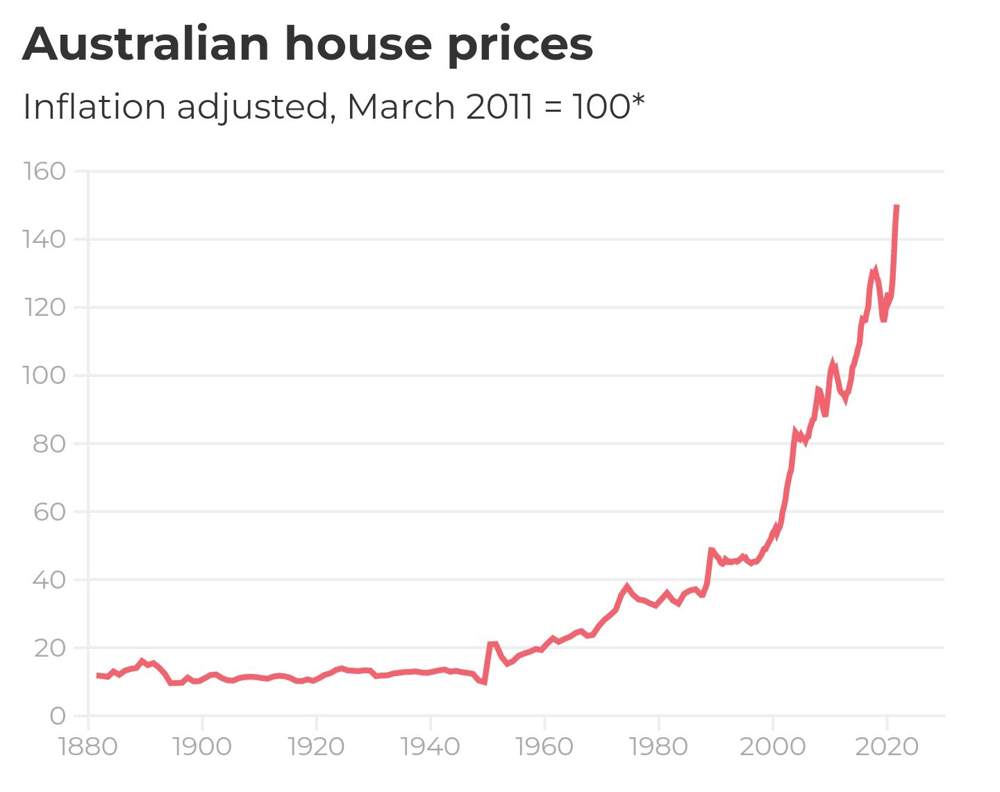
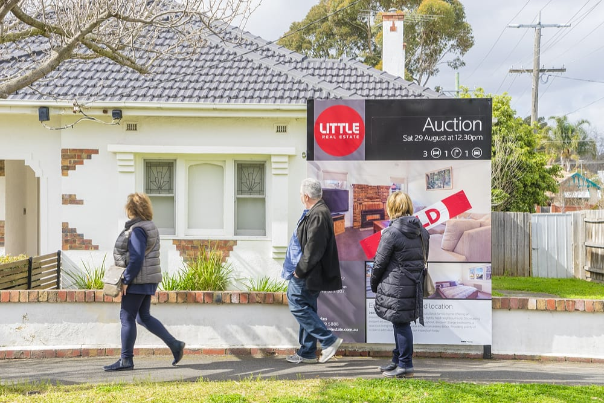
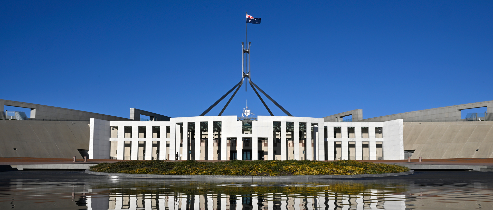

The cost of the average Australian home is, by any historical measure, deranged. Nine or ten times the average worker's annual income. Forty percent or more of household income required to service the loan. A thirty-year repayment term that, for an increasing share of buyers, will not be paid off before retirement. This is not a normal way to acquire shelter, and it is not how housing has worked for most of human history. It is barely how it worked for our grandparents. It is a seventy-year-old experiment, conducted on Australia among other countries, and our nation is now paying a price for it that we can no longer afford.

The Australian residential mortgage should be abolished. Not reformed. Not capped. Not made more responsible. Abolished.

I will argue on three grounds; that mortgage lending is the engine inflating Australian house prices, that it is economically parasitic, and that it is hollowing out the country's demographic future. I will then deal with the obvious objections, including the one that concerns me the most: that doing this would wipe out the equity of millions of recent buyers.

My preferred path is a legislated phaseout over fifteen years. A public schedule, ratcheting down loan-to-value ratios and loan terms each year, written into law in a way that is hard to unwind. My fallback, if that proves politically impossible or is sabotaged by a future government bending to the banks, is simpler: we close the window on a Tuesday morning and do not reopen it. Both options end in the same place. Only one of them is gentle.

## A short history

Before I argue against the residential mortgage, I owe the reader a brief account of what one is, and how it came to occupy the place in Australian life that it now does. Most of us treat the mortgage the way we treat the road network: a permanent feature of the landscape, something the country has always had and presumably always will. The reality is that this landscape was built, in living memory, by specific people making specific decisions - and what was built can be unbuilt.

For most of human history, the overwhelming majority of people did not own the homes they lived in. The small minority who did either inherited them, built them, or saved for years and bought them outright. Banks did not lend ordinary wage earners eight times their annual income against a residential property; the instrument did not meaningfully exist. Don't get me wrong, pre-modern housing was no paradise. Most people were tenants of landlords whose power over them was often considerably worse than a bank's. My argument is narrower: the specific mechanism we now treat as the natural way to acquire a home is a recent invention, and a recent one even in Australia.

Through the nineteenth century and well into the twentieth, residential lending here was small, fragmented, and conducted largely through building societies, savings banks, and government-backed schemes rather than the major trading banks. Banks were classified as either savings banks, whose lending was restricted to mortgages and which paid almost no interest to depositors, or trading banks, which served business rather than the general public. Credit was rationed, loan-to-value ratios were conservative, and most Australians who owned their homes had either saved for them, inherited them, or borrowed modestly over a relatively short term.

The thing we now call the Australian mortgage market (the one that lends a million dollars to a couple in their thirties so they can buy a dilapidated shack from a couple in their sixties who paid twenty thousand for it) is a product of the 1980s and after. Deregulation through that decade dismantled the wall between savings and trading banks, opened the market to foreign banks, and removed the controls that had kept residential lending modest. The growth of mortgage brokers, securitised home loans, and non-bank lenders through the 1990s and 2000s turned what had been a rationed product into a competitive one. Lenders Mortgage Insurance, low-doc loans, interest-only loans, redraw facilities... every one of these "innovations" has only made it easier to borrow more, against less, for longer. The mortgage market we have today is about forty years old. It is younger than the Sydney Opera House and colour television. The country existed without it, and was in many ways better at housing its people without it than with it.

There is one more thing worth saying, briefly, because the rest of this essay leans on it. When a bank writes a mortgage, it does not lend out money that someone else has saved. It creates the money as a new entry on its own balance sheet, and the borrower hands that newly-created money to the seller. The bank then collects principal and interest for thirty years on money that did not exist before the loan was written.

This sounds like a fringe claim but it's not. The Bank of England in 2014 published a paper titled _Money creation in the modern economy_ explaining the mechanism in plain terms, and no serious central banker disputes it.

Hold this fact close. We will need it in the next section, when we ask what happens to the price of a fixed stock of houses when the mechanism for bidding on them can manufacture its own ammunition.

## Mortgages inflate house prices

For one hundred years, from 1890 to 1990, the average house price grew, after inflation, by about half a percent per year. Then something changed. Over the next thirty years, prices roughly tripled in real terms. The country's land mass did not change. The population grew, but at rates Australia had managed before. Including the 1950s and 1960s when prices were flat in real terms. The number of bricks and bricklayers did not transform overnight. What changed, and changed precisely on the timeline that prices began to climb, was the supply of credit.

This is not a fringe analysis. It is the position of the Reserve Bank itself. In its [2003 submission to the Productivity Commission](https://www.rba.gov.au/publications/submissions/housing-and-housing-finance/inquiry-productivity-commission-on-first-home/factors-behind-recent-rise-in-house-prices.html), the RBA concluded that of the factors driving the rise in house prices, the dominant one was changes in the supply of credit and the capacity of households to borrow. Not population. Not supply constraints. Credit. The bank that runs the country's monetary policy looked at the data and told the government, in writing, that the thing inflating house prices was the thing the bank itself enables.

The mechanism is not subtle. A house gets sold to whoever bids the most for it, and almost no Australian buys a house with cash. The bidder is a bank. When the banks will lend more, bids go up and prices follow them. When they lend less, prices fall. We've actually run this experiment more than once in living memory: APRA tightened investor lending in 2017 and prices flinched. The RBA lifted rates in 2022 and prices fell off a cliff. The relationship between credit availability and house prices is not contested. It is repeatedly observed by everyone watching the market, including the regulators who occasionally turn the tap on and off and watch what follows. Prices respond to the tap.

## Mortgage lending is economically parasitic

The first charge against residential mortgage lending is that it inflates prices. The second charge is harder, and more damning. Mortgage lending produces nothing.

It builds no houses. The houses already exist, or are built by tradespeople using materials supplied by manufacturers; none of whom need the bank to do their work. It manufactures no goods. It develops no technology. It trains no workers. It does not feed, clothe, transport, or treat anyone. When a bank writes a mortgage, the country has exactly as many houses, exactly as many jobs, and exactly as much productive capacity as it had the moment before. What it has, that it did not have a moment before, is a thirty-year stream of interest payments flowing from a working household to a financial institution. That is the entire output of the transaction. Everything else is bookkeeping.

Defenders of the system will object that this is unfair: that mortgage lending _enables_ home ownership, and that home ownership is itself a productive social good. This is a trick. Home ownership existed before mass mortgage lending. The country housed itself, with admittedly variable success, for the entire period between European settlement and the 1980s, and during much of that period the proportion of Australians who owned their own homes was higher than it is today. What mortgage lending enables is not home ownership. it is _leveraged_ home ownership - the purchase of a house with money the buyer does not have, against the security of the house itself. The thing being financed is not the house. It is the buyer's permission to bid above the price they could otherwise have paid.

Which brings us to what is actually happening when an Australian buys a house in 2026. They are not, in any meaningful sense, paying for the house. The bricks have not become more valuable. The land beneath them is no more useful than it was thirty years ago. What has become more expensive is the _claim_ on the house; the right to extract thirty years of mortgage payments from whoever services the loan, or rent from whoever lives in the property. The price an Australian pays for a house is, increasingly, the present value of future debt servicing. The buyer is not bidding on shelter. They are bidding on the largest debt the bank will permit them to carry, and the seller (and the bank, and the next buyer in the chain) is betting on the same thing: that future Australians will earn enough to keep these payments flowing. The mortgage is not financing housing. It is harvesting wages, in advance, against an asset that already exists.

This is what makes the system parasitic rather than productive. A productive economic activity adds something to the country - a building, a service, an invention, a barrel of wheat. A parasitic one redirects existing flows of value without adding to them. Australian residential mortgage lending, for forty years, has been the largest single redirection of national wealth from labour to finance in the country's history. The wages of working Australians, present and future, are being capitalised into the prices of houses they already live in, and skimmed by the institutions that issue the loans.

Now consider what those flows of capital could be doing instead. Australia has a chronic problem with productive investment. Our businesses are starved of patient capital. Our research and development spending lags our peers. Our manufacturing sector has been hollowed out for a generation. We export rocks and import almost everything else. There are reasons for this - geographical remoteness, the difficulty of scale - but one of those reasons, which nobody much wants to discuss, is that for forty years the safest, most leveraged, most government-backstopped return on capital in Australia has been bidding up the price of an existing house. If you are an Australian with money to deploy, why would you fund a small manufacturer, or back a software startup, or take a chance on a new agricultural process, when you could buy your fourth investment property and watch the bank do the work for you?

The answer is that mostly you wouldn't, and mostly we don't. The capital is in the houses. It is locked there. It is doing nothing - earning a return, certainly, but producing nothing the country can eat, sell, or use. Close the mortgage tap and that capital has to go somewhere. It will not all flow productively. Some of it will flee offshore, some will sit in cash, and some will find new creative ways to be useless. But a meaningful portion of it will, for the first time in a generation, have to go looking for actual businesses to fund because the easy parasitic return will no longer be available.

This is the second charge. The mortgage is not just inflating the price of housing. It is starving the rest of the economy of the capital that built it.

## Australia is running out of Australians

I have three children. I am acutely aware that this makes me, by the standards of the country in which I live, an outlier, and increasingly an old-fashioned one. The total fertility rate in Australia in 2024 was 1.481 births per woman, a record low. The replacement rate, the level required to maintain a population in the absence of migration, is around 2.1. Australians have not produced enough children to replace themselves since 1976 - almost exactly to the date, give or take a few years, when the credit tap opened and the modern mortgage market began its work. The two timelines are not unrelated. They are, I will argue, the same timeline.

The numbers will get worse before they get better, if they get better at all. Australia's current trajectory is approaching the point of no return; the territory below which, in international experience, no country has ever recovered to replacement-level fertility. The median age of mothers in Australia is now 32.1, the highest on record. The median age of fathers is 33.9. The country is having fewer children, later in life, and a growing share of Australians are having no children at all. This is what demographic exhaustion looks like, and it's happening all around us right now.

There are many things one can say about why. Climate fears, cost of living, female workforce participation are all often cited. None of these explanations is wrong, but they all sit on top of something more fundamental. Something rarely named in the discussion because naming it would implicate the entire structure of Australian wealth; people are not having children because they cannot afford the houses to raise them in.

This isn't speculation. It's what young Aussies say when asked. The cost of housing is the most consistently cited reason couples give for delaying or forgoing children. It's not the only reason, but it is the dominant one. And it is downstream - directly, mechanically, not metaphorically - of the credit system against which this essay seeks to argue. The reason a young couple in Perth can't afford a third bedroom is that the price of the third bedroom is set by what the bank will lend the next couple, and the bank will lend an enormous amount, and so the third bedroom costs more than the couple can possibly earn while also paying for the children who would sleep in it.

I'll tell you what this looks like from the inside. I have a daughter old enough to ask the kinds of questions that children ask when they are starting to suspect the adults around them are not entirely in control of the world. _Where will I live when I grow up? Will I have a house like this one?_ The honest answer, under current conditions, is that I don't know. If she does the things her grandparents did: finishes school, works hard, marries a decent person, saves what she can, there is no path I can describe, on a piece of paper, that ends with her owning a house in the country she was born in. Not without us dying and leaving her one. And I am not, by Australian standards, poor. I have a job, my mortgage is my only debt. My children will probably be fine, in the way that the children of property-owning parents are fine, which is to say they will inherit. They will be participants in the great Australian inheritance lottery - the system in which the question _will you own a home?_ has been answered, for the next generation, by the question _did your parents?_

This is the third charge, and this is not the least of them. The mortgage system is not just inflating prices, and not just starving the economy. It is producing a country in which the formation of families has become a privilege of inheritance. The young couple who are not having a third child, or second, or any, are responding rationally to a price signal. The signal that says _the country has decided to extract the cost of your housing from your future, and it has decided to do this with such efficiency that there is nothing left over for the children who would have lived in that housing._ People will not have children they cannot house. This isn't selfishness, it's arithmetic.

The country knows this. The country has known this for some time. Government-funded incentives like the Howard-era baby bonus have been studied, and the conclusion is that while they raise fertility for some groups, they cannot fully counter broader demographic trends. The "broader demographic trends" is the polite phrase for _we have made it impossible for ordinary people to afford the kind of life in which children naturally happen_. You cannot fix that with a one-off payment. You cannot fix it with first-home-buyer grants, which simply add to the deposit gap and get capitalised into prices the next quarter. You cannot fix it with childcare subsidies, useful as those can be. The binding constraint is the cost of the room in which the child would sleep.

There is one thing that would fix it. There is one thing that, addressed honestly, would unwind the price of housing back to a level at which ordinary Australians could afford the kind of family their grandparents took for granted. It is the thing this essay is about.

## Yes, prices should collapse. That is the point

The strongest objection to everything I have thus far argued is the obvious one. _If you do this, house prices will crash._ And the answer is: yes. They will. They should. And that is what the country needs.

I want to be precise about what I mean. I do not mean a five percent correction, or a fifteen percent dip, or any of the polite haircuts that the property industry occasionally describes as a "soft landing". I mean a fall in nominal house prices of somewhere between ninety and ninety-five percent. I mean a country in which the median house, currently priced at over a million dollars in most capitals, costs sixty thousand. I mean the price of shelter returning to something like its actual relationship to the cost of building it and the wages of the people who live in it. I mean an end to the era in which Australian houses are priced as financial instruments and a return to the era in which they were priced as places to live.

This will sound, to most readers, like economic vandalism. It is not. It is a correction. The thing that needs explaining is not why prices would fall to that level. The thing that needs explaining is why they were ever allowed to rise above it. A house is bricks, timber, glass, plumbing, wiring, and a patch of dirt. The cost of these things, in 2026, is what it has always been; a few months of an honest worker's wages, give or take. Everything above that figure is the capitalised value of future debt. Strip out the debt and the house costs what the house costs. Sixty thousand is not a fantasy number. It is, roughly, what an Australian house costs to build, plus a reasonable margin for the land. The current price is the fantasy. We have been living inside it for so long that the fantasy has come to feel like the floor, and the floor has come to feel like a catastrophe.

Consider what changes when prices fall by ninety percent. Young couples buy houses outright, in cash, in their late twenties. As their grandparents did, and as their great-grandparents did before them.

The thirty-year mortgage, that thirty-year drain on a household's wages, simply ceases to be a feature of ordinary life. Children grow up in houses their parents own free and clear. The bedroom does not cost more than the child.

Capital, as I argued earlier, has to find something else to do, and some portion of it begins to fund Australian businesses again, because there is no longer a parasitic alternative paying better.

Family formation recovers, not because the country has handed out baby bonuses, but because the country has stopped charging young couples a million dollars for permission to have a third child. The birthrate, slowly, begins to climb. The country, slowly, begins to grow again.

This is not a vision of catastrophe. This is a vision of a country recovering from one.

But I will not pretend this recovery is painless, because it isn't. Pretending so would be dishonest in a way the rest of the essay has tried not to be. There is a hard moral question at the centre of this proposal, and the honest thing to do is to acknowledge that I am personally inside it.

I bought my house recently. I have a mortgage on it that I am, like most Aussies my age, still in the early years of paying down. If the policy I'm arguing for in this essay were implemented in any of its forms - phaseout or cold turkey - I would be financially devastated. I would owe the bank substantially more than the house was worth, by a margin that no individual could carry. Everything I have built toward - the equity my family was supposed to inherit, the financial cushion of the next twenty years, the quiet assumption that if things went wrong I had something to sell - would be gone. I am not arguing this from the safety of being already wealthy, or from the safety of being a renter with nothing at stake. I am arguing it from inside the wreckage I am proposing.

I want to say this clearly because the rest of this section is about the people who would be hurt by what I am proposing, and the reader is entitled to know that I am one of them. This is not a sacrifice I am asking other people to make. It is one I am asking us to make, and I am writing this essay despite the cost to my own household, because I think the cost of _not_ doing it - paid by my children, and theirs, and the children my country is failing to produce - is larger.

Here is the hard moral question. What happens to the people who bought houses recently - the couples who paid $1.2 million for a brick three-bedder in 2024, financed at six per cent over thirty years, and who would, after a ninety percent collapse, find themselves owing the bank approximately twelve times what their houses were worth? These are not investors. These are not speculators. These are ordinary Australians, my generation among them, who did the thing the country told us to do - work hard, save for a deposit, get on the ladder before it pulled up - and who would be ruined by the very correction that makes the country liveable for everyone else. We would owe more on the house than the house was worth, by a factor that no individual could possibly carry, and the bank holding the loan would be entitled to come for us.

I will not soft-pedal this. The position I am defending in this essay would, if implemented overnight, financially destroy a generation of recent buyers, myself included. That is the honest accounting, and the discussion is not worth having if it is not honest about its own costs.

Here is what I think can be said in response. First, that the people in negative equity are not, ultimately, the people the bank wants to be repaid by. The bank wants the house. If the bank cannot extract thirty years of payments from a household whose loan is twelve times underwater, the bank's calculation is to foreclose, write off the loss, and move on. The household that has lost its house has not lost its life. It has lost a leveraged bet that the country was going to keep extracting wealth from young people forever. That bet was always going to come due. It was a question of when, not whether, and of which generation would carry the cost. Better the recent buyers - better me, and the people in my position - than the unborn, who will not exist at all if the system continues.

Second, that the negative-equity problem is exactly why the phaseout is preferable to the cold-turkey option. A fifteen-year glide path, with credit availability ratcheting down on a published schedule, allows prices to fall over a period during which most recent buyers will have paid down enough principal, and earned enough additional income, to cushion the worst of it. Not all of us. Some buyers, especially those who bought at the peak with high loan-to-value ratios (especially those who used the new 5% deposit scheme) will still end up underwater. But the scale of the harm is reduced from "generational ruin" to "a difficult decade". That is worth the trade. I am, again, willing to take that trade myself.

I will not pretend any of this is clean. It is not. There is no version of this transition in which nobody is hurt, and there is no version in which I'm not among those hurt. The country owes recent buyers a transition that is as gentle as it can be made, and the phaseout is what that looks like. The choice the country faces is not between disruption and stability. It is between a generation of recent buyers, myself included, carrying the cost of a correction over a decade and a half, and every future generation of Australians carrying the cost of the unreformed system, forever.

I know which one I would choose. I am writing this essay because I think the country, if asked the question honestly, would choose the same thing.

## The objections

An essay of this length owes the reader an account of the obvious objections, of which there are four major ones that have to be dealt with before we can close.

**On supply, and zoning.** The standard line is that the housing crisis is a supply problem, sometimes paired with a zoning problem. Build more houses. Reform the zoning rules that prevent us from building more. Each of these claims is, in isolation, partially true. Neither, on its own or together, can explain the magnitude of what has happened.

Consider the timing. Australian house prices grew at half a percent per year, after inflation, for an entire century. Then, in the 1990s, they began climbing and they have not stopped. The country did not suddenly run out of land in the 1990s. It did not suddenly invent restrictive zoning. The thing that changed in the 1990s was the supply of credit, and everything else is downstream.

Build a hundred thousand new dwellings and, with the credit tap open, they will be bid up to whatever the bank will lend on them. Zoning reform produces, predictably, more housing at the same unaffordable prices: exactly what we have already seen in the apartment markets of inner Sydney and Melbourne. None of these levers, pulled in isolation, can do anything more than rearrange the furniture. The credit is the engine. Everything else is the chassis the engine is bolted to.

**On migration.** This is the loudest framing in the current debate, and the one I want to handle most carefully, because the post-2005 numbers are real and sustained and they do affect the housing market. Net overseas migration reached a record 536,000 people in 2022-23 and was 435,000 in 2023-24, well above pre-pandemic levels. Migration on this scale puts genuine pressure on rents, on infrastructure, and on the broader cost of urban life. None of that is in dispute.

But the bidding mechanism for an Australian house is not migrants bidding against locals. It is _banks_ bidding against banks, lending against the income of whoever happens to be standing at the auction. Strip out the credit and the bidding contest deflates for everyone, regardless of where the bidders were born. A migrant family with no access to a mortgage cannot bid $1.2 million for a house, and neither can the locals competing with them. Migration sets the rental floor. Credit sets the ownership ceiling. They are different markets, and the mortgage system is what fuses them into the trap young Australians are now caught inside.

The chronology matters too. Net overseas migration was substantial throughout the post-war period, and migration's role as the dominant component of population growth only began in 2005-2006, well after the price escalation of the 1990s was already underway. The country was not having a migration crisis in 1995, when prices started climbing. It was having a credit crisis. The migration pressure that came later is real, but it is layered on top of a system that had already broken its relationship to the cost of building and the wages of the people doing the building. End the credit and the migration pressure becomes a question about rents and infrastructure, both of which are tractable. Continue the credit and no migration policy, however restrictive, will return ownership to the country's young.

**On foreign buyers.** This one is simpler. If residential mortgage lending is to be wound down inside Australia, the obvious evasion is to allow it to continue from outside. A buyer in Singapore borrowing from a Singaporean bank to acquire a house in Sydney is doing exactly what a buyer in Sydney borrowing from a Sydney bank would have done: bidding up the price of an Australian house with money created by a financial institution. The fact that the institution is offshore changes nothing about the effect on the local market.

The remedy is straightforward and has to be absolute. Foreign purchases of Australian residential property must be banned outright, and the ban must extend to the _financing_, not just the buyer. A foreign-owned company purchasing through an Australian subsidiary is a foreign purchase. A loan from an offshore lender to an Australian buyer, secured against an Australian house, is a foreign mortgage and must be treated as one. Anything less than this is theatre. Australia has experimented with foreign-buyer restrictions before (the Foreign Investment Review Board, the various state-level surcharges) and the experimentation has produced, predictably, an industry of workarounds. The reason the workarounds work is that the rules have always been written with loopholes. The replacement rule is one sentence: _no resident foreign capital may be deployed into Australian residential property, in any form, by any vehicle, ever._ Writing the legislation is harder than writing the sentence, but the sentence is the policy.

**On business loan loopholes.** This is the most technical of the objections, and the one most likely to be used to undermine the policy in practice. If residential mortgages are unavailable, the obvious move for the kind of investor who currently buys a fourth investment property is to restructure as a business (a sole trader, a trust, a discretionary company, a self-managed superannuation fund (SMSF)) and acquire residential property as a business asset, financed by a business loan. Business loans are not residential mortgages. The policy as drafted does not cover them. The investor proceeds as before, and the entire reform is hollowed out within five years.

The fix here is also straightforward, though it requires a regulator with teeth. Loans against residential property, regardless of the legal vehicle of the borrower, must be treated as residential mortgages, and the residential mortgage prohibition applies to all of them. A business that holds a residential property as an asset must hold it without leverage, or hold it with leverage that has been written before the policy began and is being wound down on the same schedule as everything else. SMSFs cannot borrow to acquire residential property. Trusts cannot borrow to acquire residential property. Companies whose business is the holding of residential property are not businesses; they are landlords with extra paperwork, and they receive no special treatment. The principle is simple: _the use of the property determines the rules, not the legal form of the owner._ Where the property is residential, the residential rules apply.

These four objections do not exhaust the field. There are others, weaker ones, that the property industry will produce in volume the moment a serious version of this proposal is debated. _What about the superannuation funds that have invested in residential mortgage-backed securities? What about the construction industry that depends on mortgage-financed buyers?_ These are real questions, and they have answers, and the answers are not in this essay. They are in the next one. The essay you are reading is making a single argument: that the residential mortgage, as an Australian institution, must end. The mechanics of the ending are real work, and important work, but I'd like the argument for the ending to stand or fall on its own terms.

## How: cold turkey, or the long walk

Two paths lead to the same destination. The country can switch off residential mortgage lending overnight, or it can wind it down over years on a published schedule. Both end with the same outcome: a country in which banks no longer create money to bid up the price of houses and houses return, slowly or suddenly, to something like their actual value. The difference is the route, and the question of which route is preferable is the last argument this essay has to make.

Cold turkey first, because it is the cleaner version, and because readers should know it exists.

The mechanism is simple. Parliament passes legislation. As of a specified date — call it the first Tuesday of the next financial year — Australian banks may no longer write residential mortgages. Pending applications are void. Existing mortgages continue to be serviced under their existing terms, because the policy is forward-looking and does not retroactively cancel debts. But no new residential mortgages are written, by anyone, ever again. The window closes. It does not reopen.

The case for cold turkey is honesty and speed. It does not give the affected industries fifteen years to organise their lobbying. It does not depend on every successive government honouring a schedule. The damage is concentrated, severe, and finite. The country gets the correction over with and begins to rebuild on the other side. If I had a button on my desk that ended the Australian residential mortgage on a Tuesday morning, I would press it Monday night.

But I am not arguing for cold turkey, because cold turkey is politically impossible in the country we actually live in, and a policy that cannot be enacted is not a policy. It is a fantasy.

The argument for the phaseout is not that cold-turkey would fail to work. It would work. It would be brutal, and it would work. The argument for the phaseout is that the cold turkey version is politically impossible in the country we actually live in, and a policy that is impossible to enact is not a policy. It is a fantasy. The mortgage system has spent forty years embedding itself into every level of Australian wealth, governance, and self-conception. The banks will spend whatever it takes to prevent the overnight version. The property industry will spend whatever it takes. The retired homeowners whose paper wealth depends on the continuation of the system will spend whatever the banks and the property industry tell them is at stake. A government that proposed cold turkey would not be a government for very long, and the policy would not survive the next election.

The phaseout is the version of this proposal that can actually be accomplished.

A legislated, year-by-year reduction in the maximum loan-to-value ratio and the maximum term of new residential mortgages, ratcheting down on a published schedule, with the schedule itself written into legislation that requires a parliamentary supermajority to amend. The exact numbers are a question of legislative drafting, not for this essay. But the shape is a downward staircase that everyone - buyers, sellers, banks, regulators - can see in advance and plan around. Each year the maximum loan gets smaller. Each year the maximum term gets shorter. Each year the credit available to bid for an Australian house contracts. Prices fall, gradually, as the credit fuel is withdrawn. As the tap is slowly closed. By the end of the schedule, the residential mortgage as a financial product no longer exists, because the rules have made it impossible to write one.

The advantages of this version are several. It gives recent buyers (including myself) time to pay down the principal and earn additional income against the falling value of their houses. It gives the banks time to wind down their residential lending books in an orderly way, which matters not because the banks deserve consideration but because a chaotic bank failure would damage everyone, including the people the policy is trying to protect. It gives the property industry time to redirect its capital and its workforce into something productive - actually building houses, for instance, rather than financialising them. It gives the country time to absorb the correction without the kind of shock that produces irrational political backlash and reversal.

Most importantly, the phaseout is harder to undo. A future government bending to banking pressure, or simply elected on a platform of _let's go back to the way things were_, would face the choice of either reversing the schedule (which a supermajority requirement would make very difficult) or simply doing nothing and letting the schedule continue. Cold turkey could be reversed by a single act of parliament on the morning after the next election. The phaseout, properly entrenched, becomes harder to undo each year that passes, because the prices have already adjusted, the recent buyers have already absorbed the cost, and reversing course would mean inflicting a new round of harm on a different set of people. By the time the phaseout has been running for five years, the political coalition for completing it is larger than the coalition for reversing it. By ten years, reversal is essentially inconceivable.

I will close this section by saying something about the relationship between the two versions, because it matters for what kind of polemic this essay actually is. The cold-turkey option is not a rhetorical flourish. It is a real position, held by myself, available to the country if the phaseout is sabotaged or delayed beyond bearing. The phaseout is the offer made in good faith by a writer who would, if forced, prefer the other thing. The country should accept the offer, because the offer is the gentlest version of a transition that is going to happen one way or another. The unreformed system is not stable. It is being held up, increasingly, by inheritance, by foreign capital, by ever-larger loan terms extending into ever-later retirements, by the willingness of young Australians to indenture themselves to a debt none of their grandparents would have recognised. That arrangement has a finite life. The question isn't _will the system end?_ The question is when it does end, will it be on terms that we have chosen? Or will it be the terms imposed on us by the eventual collapse of an arrangement that was never sustainable to begin with.

The phaseout is the country choosing. The cold turkey is what we get if we don't.

## On the other side

I want to describe the Australia that I see down the end of this road. It's a country in which the price of a house bears some defensible relationship to the cost of building it. A country in which financial capital, denied the easy parasitic return on residential property, has to find productive uses for itself; funding businesses, backing inventions, paying for the kind of patient long-term investment that builds a real economy instead of an inflated one. A country in which the formation of a family is not a function of inheritance. A country in which young people, looking forward into their working lives, can see the outline of a life that resembles the lives of their grandparents; not because the country has gone backwards, but because it's stopped going sideways into a financialised dead end.

That is the structural picture. Here is the human one.

A young couple in Perth, in their late twenties, both working ordinary jobs - a nurse, an electrician, a teacher, a shop manager. They have saved for a few years. They have a deposit that, in the country we live in now, would not cover the stamp duty on a one-bedroom apartment. In the country on the other side of this proposal, it covers the house. They sign the papers. They move in. They do not have a mortgage, because mortgages do not exist. Their wages, free from being capitalised into the price of housing, are theirs to spend on things wages were always supposed to buy - food, education, holidays, savings, the second child they had been quietly assuming they could not afford. The bedroom does not cost more than the child. They have the child.

A small Australian manufacturer, somewhere in regional Victoria, looking for capital to expand. In the country we live in now, the capital is busy. It is sitting in investment properties, leveraged into bank balance sheets, earning returns that no productive business could match. In the country on the other side, the capital has nowhere comparable to go. It comes to the manufacturer instead. The factory expands. The town gets jobs that did not exist a year ago. This happens, in some version, in a hundred other towns. The country, slowly, learns again how to make things.

These are not utopian scenes. They describe how the country worked, more or less, for most of the twentieth century, before we built the system this essay is arguing against. The recovery is not a return to the past (most of the past was, in various ways, worse than the present) but a recognition that one specific arrangement, the universal mortgage society, has had its run, and that the country is allowed to choose something else.

I want to close by saying something I've been trying to keep at the edges of this essay, because the structural argument is sturdier than any personal one I could make. But the structural argument is not, after all, why I've written this thing.

My curious daughter and her questions? This essay is, in some sense, the long version of the answer I owe her. It is the answer of a father who has worked out, after some years of looking at it, that the thing standing between his daughter and the kind of life he was given by his own parents is not a mystery, not a complicated multi-factorial problem requiring further study, not something that a series of incremental policy adjustments will eventually get on top of. It is a single institution, doing exactly what it was built to do, and continuing to do it because nobody with the power to stop it has yet been willing to. The institution is the residential mortgage. The willingness is what this essay is asking for.

The alternative to doing this is a country that quietly stops having children, that exports its capital to other people's economies, that watches its young people inherit or rent or leave, and that congratulates itself on its house prices while the foundation of the thing erodes underneath.

That country is the one we currently inhabit. The other is on the other side of a single decision, made by a parliament we have not yet elected, in a future we have not yet chosen.

So choose.
